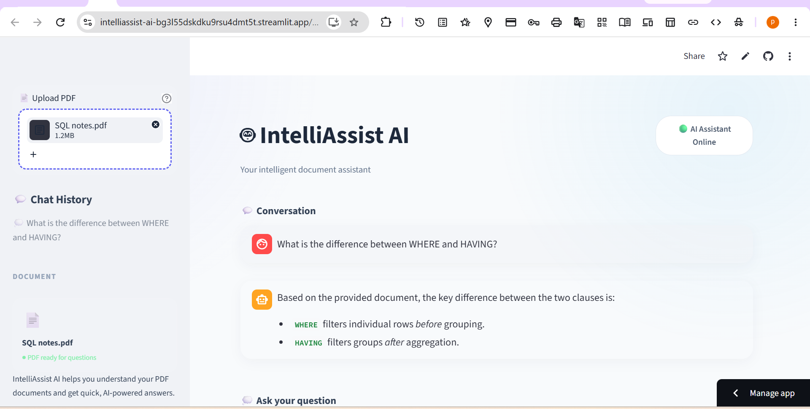

# 🤖 IntelliAssist AI

An AI-powered PDF Document Assistant that helps users upload PDF documents and ask questions based on the document content.

## 🚀 Live Demo

👉 [Try IntelliAssist AI](https://intelliassist-ai-bg3l55dskdku9rsu4dmt5t.streamlit.app/)

### 📸 Project Preview

    
## ✨ Features

- 📄 Upload PDF documents
- 🤖 AI-powered question answering
- 💬 Smart Q&A
- ⚡ Fast and clear responses
- 🔒 Document-based answers
- 🧠 Gemini AI integration

## 🛠️ Technologies Used

- Python
- Streamlit
- Google Gemini AI
- LangChain
- PyPDF
- HTML/CSS

## 📌 Project Description

IntelliAssist AI is an intelligent document assistant that allows users to upload PDF files and interact with their documents using AI-powered question answering.

## 👩‍💻 Developer

**Pranjali Dhanbhar**
